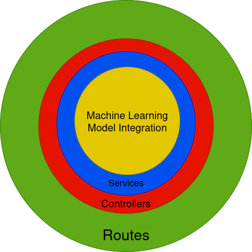

# Nasa Challenge

## A World Away: Hunting for Exoplanets with AI

## Installation

```bash
git clone https://github.com/benedictotavio/gote-backend.git
cd gote-backend
npm install
npm start
```

### Overview:

Utilizing data from various space-based exoplanet surveying missions, the project focuses on the automated identification of exoplanets using advanced artificial intelligence and machine learning techniques. Despite the manual discovery of thousands of exoplanets, the project aims to develop a model capable of analyzing extensive datasets efficiently.

### Objective:

To create an AI/ML model trained on open-source exoplanet datasets provided by NASA, enabling accurate identification of new exoplanets from incoming data.

### Key Components:

- Data Analysis: Leveraging AI/ML to process large datasets for exoplanet identification.
- Dataset Utilization: Use of publicly available datasets from NASA.
- Machine Learning: Implementation of advanced algorithms for accurate predictions.

## Architecture


1. Core Component: 
Machine Learning Model Integration: This is positioned at the center of the architecture, indicating that the machine learning model is the primary functionality around which the other components revolve.

2. Surrounding Layers:
a. Services: Enclosed in yellow, this layer likely contains the various services that interact with the machine learning model, handling data processing, and executing business logic.
b. Controllers: Shown in blue, this layer possibly represents the interfaces that manage input from users or other systems, directing data to the appropriate services.
c. Routes: Marked in red, this outer layer likely outlines the paths for data flow within the system, indicating how different endpoints are connected and how requests are routed through the architecture.

3. Overall Structure:
The architecture follows a concentric circle model, with each layer serving a specific purpose while ensuring that the machine learning model's functionality is central to the system's operation. The use of distinct colors for each layer aids in visual differentiation, facilitating understanding of the interactions and dependencies among the various components.


## Workflow


> Frontend: [gote-frontend](https://github.com/benedictotavio/gote-frontend)

> Backend: [gote-backend](https://github.com/benedictotavio/gote-backend)

> Machine Learning: [gote-ml](https://github.com/benedictotavio/gote-ml)

## Routes

| Route | Method | Description |
| --- | --- | --- |
| /upload/exoplanet | POST | Upload a .csv file for exoplanet classification. |
| /upload/model | POST | Upload a .csv file for model retraining. |
| /stream/exoplanet | POST | Stream a .csv file for exoplanet classification. |

#### Upload .csv - Exoplanet Classification

```shell
curl --location 'https://gote-backend.onrender.com/upload/exoplanet' \
--form 'file=@"/C:/Users/Bianc/Downloads/input_completo.csv"' \
--form 'mode="explorer"' \
--form 'dataset="k2"' \
--form 'hyperparameters="{\"eval_metric\": \"string\",\"objective\":\"string\",\"colsample_bytree\": 0.1,\"learning_rate\": 0.1,\"max_depth\": 1,\"n_estimators\": 1,\"subsample\": 0.1}"'
```

#### Upload .csv - Model Retraining

```shell
curl --location 'https://gote-backend.onrender.com/upload/exoplanet' \
--form 'file=@"/C:/Users/Bianc/Downloads/input_completo.csv"' \
--form 'mode="explorer"' \
--form 'dataset="k2"' \
--form 'hyperparameters="{\"eval_metric\": \"string\",\"objective\":\"string\",\"colsample_bytree\": 0.1,\"learning_rate\": 0.1,\"max_depth\": 1,\"n_estimators\": 1,\"subsample\": 0.1}"'
```

#### Stream .csv - Exoplanet Classification

```shell
curl --location 'https://gote-backend.onrender.com/stream/exoplanet' \
--header 'Content-Type: application/json' \
--data '{
    "mode": "researcher",
    "dataset": "k2",
    "data": {
        "sy_pnum": 3,
        "soltype": "0.01",
        "pl_orbper": 0.01,
        "sy_vmag": 10,
        "sy_kmag": 9,
        "sy_gaiamag": 12,
        "st_rad": 1,
        "sy_dist": 100
    },
    "hyperparameters": {
        "eval_metric": "mlogloss",
        "objective": "multi:softprob",
        "colsample_bytree": 0.8,
        "learning_rate": 0.1,
        "max_depth": 4,
        "n_estimators": 300,
        "subsample": 0.8
    }
}'
```

### Deployment
Deployed on [Render](https://render.com) with the following settings:

- Node.js 23
- NPM 11

> [gote-backend](https://gote-backend.onrender.com)

## License

MIT License

Copyright (c) 2023 Benedicto Otavio

Permission is hereby granted, free of charge, to any person obtaining a copy